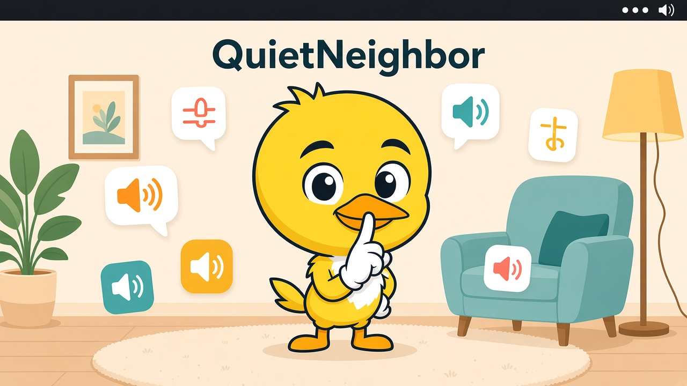
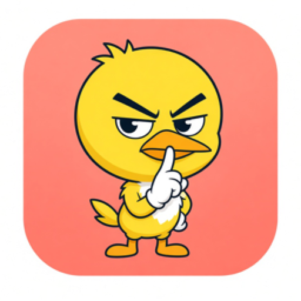
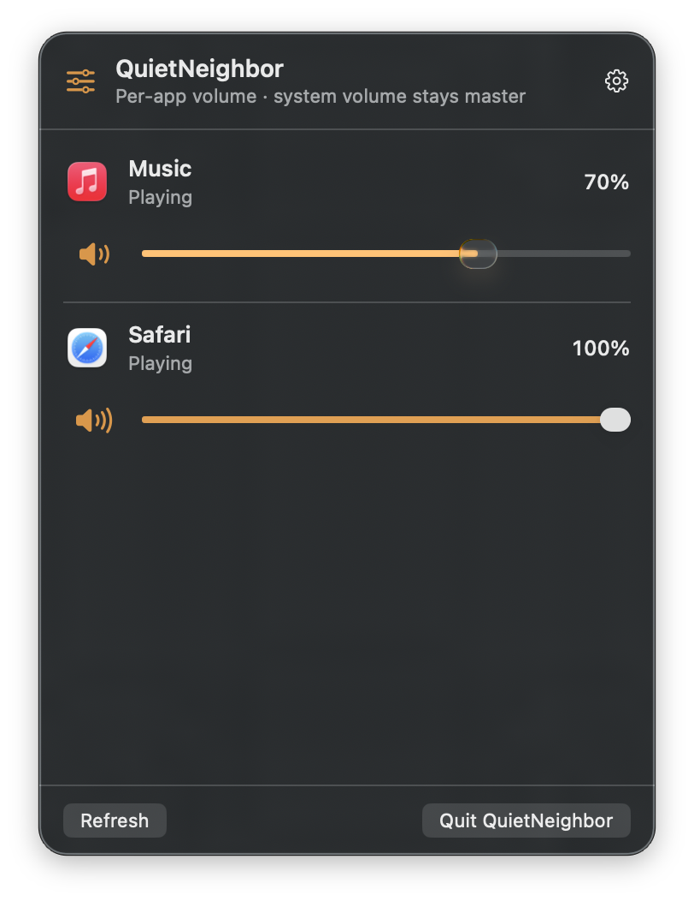

# QuietNeighbor

<p align="center">
  
</p>

Quiet the loud neighbor without turning down the whole room.

QuietNeighbor is a native SwiftUI **menu bar mixer** for macOS. Each slider is **relative gain** versus the current system volume — YouTube at 50%, Discord at 100%, and the Mac’s volume keys still run the room.

50% means half as loud as the current output. It is not mute.

## Features

<p align="center">
  
</p>

- Per-app volume slider (0–100%)
- Per-app mute (only that app goes silent)
- Levels persist by bundle identifier
- Yellow bird App Icon (the shush)

QuietNeighbor lives in the menu bar (`LSUIElement`) — look for the slider icon, not the Dock.

## Screenshots

<p align="center">
  
  <br>
  <em>Menu bar mixer — per-app relative volume</em>
</p>

## Requirements

- **macOS 14.2 or later** (Apple Silicon or Intel). Process taps (`AudioHardwareCreateProcessTap` / `CATapDescription`) shipped in 14.2.
- **Xcode 16 or later** to build from source.
- **Not App Store sandboxed.** Core Audio process taps are unreliable inside the App Store sandbox.
- A **signed** local build. Ad-hoc or `CODE_SIGNING_ALLOWED=NO` binaries compile, but taps return silence.

## Build and run

1. Clone this repo on a Mac and open `QuietNeighbor.xcodeproj`.
2. Select the **QuietNeighbor** scheme.
3. Signing: the project sets `DEVELOPMENT_TEAM` to **`4GBSMHY66W`** so Lonny’s Apple Development team can produce a signed local build by default. **If you are building this yourself, set Signing & Capabilities to your own team.**
4. Build and run (⌘R). The mixer starts at launch so saved levels apply before you open the menu.
5. Click the menu bar icon. The mixer lists apps that are producing audio, or recently did.

Command-line compile (CI / compile-only — **taps will be silent**):

```bash
xcodebuild \
  -project QuietNeighbor.xcodeproj \
  -scheme QuietNeighbor \
  -destination 'platform=macOS' \
  -configuration Debug \
  CODE_SIGNING_ALLOWED=NO \
  CODE_SIGN_IDENTITY="" \
  build
```

For a working mixer, run a **signed** Xcode build (⌘R) with an Apple Development team. Do not use an unsigned CI binary if you want per-app volume.

## Permissions

QuietNeighbor needs **both** of these grants:

1. **Microphone** — macOS often labels the audio-capture prompt this way.
2. **System Audio Recording** — System Settings → Privacy & Security → **Screen & System Audio Recording**.

An unauthorized process tap returns **silence with no error**. After QuietNeighbor mutes the original hardware path (`mutedWhenTapped`), that looks exactly like “slider below 100% mutes the app.” It is not mute — the tap never received samples.

A **signed** build is required for the second grant. An ad-hoc or `CODE_SIGNING_ALLOWED=NO` binary cannot receive System Audio Recording, so every lowered slider will sound like mute.

When a tap is running but capturing silence, the mixer shows a banner. **Open Screen & System Audio Recording** jumps to that pane. Allow QuietNeighbor, then **Recheck**.

Saved non-100% / mute levels restore on the next launch once both grants are in place.

## How it works

macOS has no public `setAppVolume` API. QuietNeighbor uses the modern HAL path:

1. **Discover** audio clients with `kAudioHardwarePropertyProcessObjectList`. Helper / GPU / WebKit processes are grouped under the owning app so Chrome or Safari appear as one row.
2. **List** those apps in the menu bar mixer with icon, name, slider, and mute.
3. **Intercept only when needed.** At 100% and unmuted, the app plays normally. If you lower the slider or mute:
   - a private `CATapDescription` mixdown of that app’s process objects
   - `muteBehavior = .mutedWhenTapped` so the original hardware path is silenced (no double audio)
   - a **tap-only capture aggregate** (no output subdevice)
   - an IOProc that writes tap samples into a stereo **ring**
   - **AUHAL** playback on the current default output, with **TapGain** applied there
4. **System volume stays master** because playback is a normal HAL client on the current output device.
5. **Persist** volume and mute in `UserDefaults`, keyed by bundle identifier (or a stable executable-path fallback).

Orphaned aggregates from a previous crash (`com.lonnylot.QuietNeighbor.agg.*`) are destroyed on launch.

## Distribution (optional)

Developer ID signing and notarization are **not** required to build from source. They are only needed later if you want to share a downloadable binary:

- Sign with Developer ID Application
- Hardened Runtime is already enabled
- Notarize and staple
- Do not enable App Sandbox

## Known limitations

- **Browsers share a process.** YouTube, another tab, and often picture-in-picture share Chrome / Safari / Arc. One slider covers that process tree.
- **Some apps never appear.** Protected, DRM, or exclusive-mode clients may not publish a process object, or a tap may be refused.
- **First adjustment can glitch.** Creating the muted tap takes a moment; you may hear a short dropout.
- **Bluetooth HFP.** If AirPods jump to a 16/24 kHz call mode, pick another output or end the call, then refresh.
- **Recently played.** `IsRunningOutput` can stay true briefly after pause. Rows stay for about 10 minutes after last playback.

## Project layout

```
QuietNeighbor.xcodeproj          Shared QuietNeighbor scheme (used by CI)
LICENSE                          MIT
docs/images/                     README hero, mixer screenshot, App Icon
QuietNeighbor/
  QuietNeighborApp.swift         Menu bar extra + Settings
  MixerController.swift          UI state, persistence, tap lifecycle
  Audio/                         Process monitor, tap → ring → AUHAL + TapGain
  Persistence/VolumeStore.swift  Bundle-id keyed UserDefaults
  UI/                            Mixer popover, mute toggle, settings
  QuietNeighbor.entitlements     Audio capture; sandbox off
```

## CI

`.github/workflows/ci.yml` runs `xcodebuild` build + `QuietNeighborTests` on `macos-latest` with signing disabled. Tests cover persistence, relative gain, silent-tap detection, and Accessibility identifiers. Live audio still needs a signed Mac build.

## License

[MIT](LICENSE) © 2026 Lonny Kapelushnik
